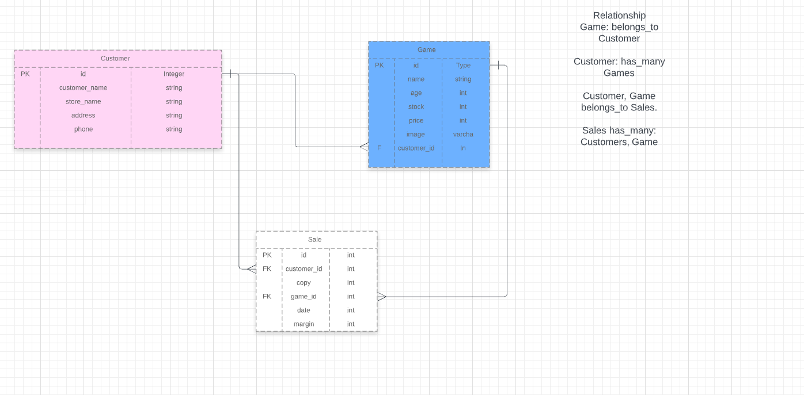

# README

### Crazyjoe 
This is a simple app showing Crazyjoe's store, where investories are kept.

## Built With
This project development was achieved using the following technologies:

- Ruby on Rails,
- Bootstrap and CSS

## Live Demo

## Model architecture for the app

## Getting Started

To get a local copy up and running follow these simple example steps.

### Prerequisites

#### You should have installed git on your local machine and a text editor of your choice.
### Setup

- Forking the project-Repository
- Cloning the project to your local machine
- `cd` into the project directory
- Run `bundle install` to install the Gemfiles
- Run `db:migrate` to install the Gemfiles
- From the root directory, run `rails server` to start the Project on `localhost:3000`
 

## Author

👤 **Author**

- Github: [@haraphat01](https://github.com/haraphat01)

* ...
# crazy_joe
